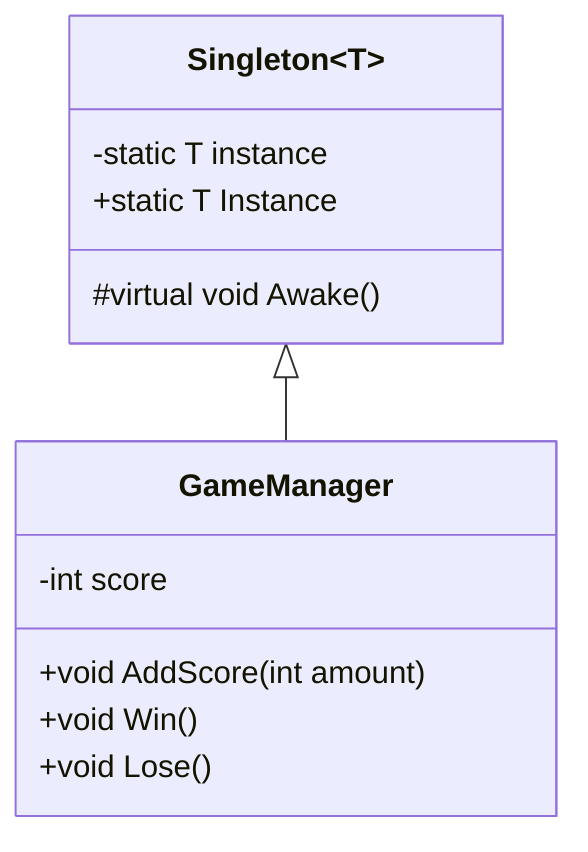
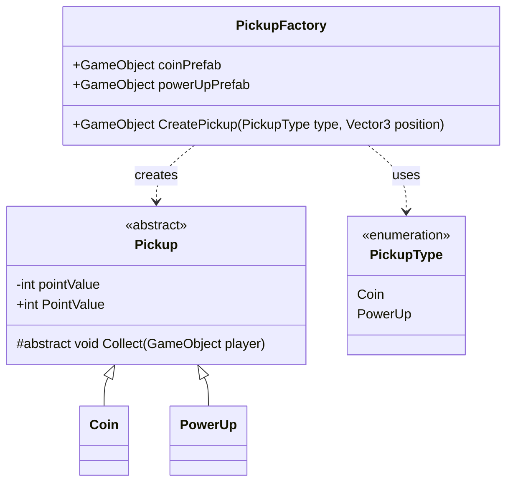

# 3D Coin Collector Platformer

**Name: Ahmed Mounib
**Student Number: 100791126

## Gameplay Loop
The player moves and jumps through a 3D level, collecting coins for points
and a power-up for a temporary speed boost, while avoiding a hazard that
resets their position on contact. Reaching the goal completes the level.

## Design Patterns Used

### Singleton — GameManager

### Factory — PickupFactory

## Reflection

**What element of your game adopts the chosen pattern?**
My GameManager uses the Singleton pattern to track score and win/lose
state, so any script can update it without needing a direct reference.
My PickupFactory uses the Factory pattern to spawn Coin or PowerUp
objects based on a simple type parameter, instead of the game needing
to know which prefab to create directly.

**Why is this pattern a good choice for the associated functionality?**
Singleton makes sense here because there should only ever be one
GameManager keeping track of the score, so there's no risk of two
managers giving conflicting numbers. Factory makes sense for pickups
because it keeps all the object-creation logic in one place, so I can
add new pickup types later without changing the code that spawns them.

## External Assets Used
[List anything you didn't make yourself here, e.g. "Quaternius Ultimate
Platformer Pack (CC0) — character model and animations" — leave as "None,
all assets are original" if you haven't swapped in outside assets yet.]
